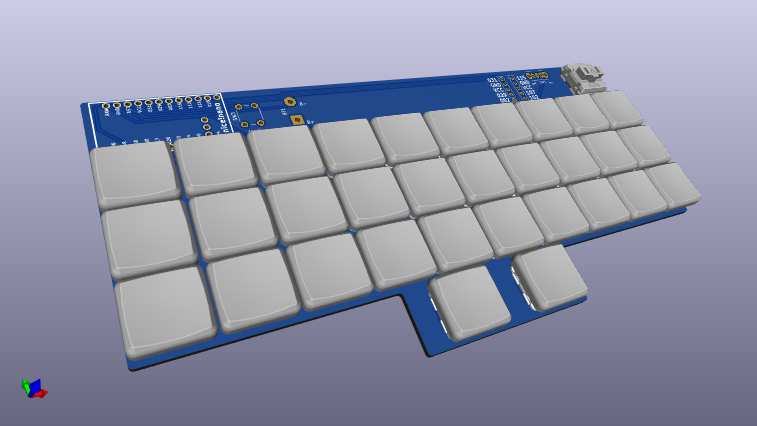

# Micro Quertz Keyboard PCB

KiCad 7 PCB layout project for a 32 key keyboard with Kailh PG1232 Mini Choc switches and a nice!nano microcontroller.

[Firmware](https://github.com/honboubao/mqz_fw)

[Keyboard layout](http://www.keyboard-layout-editor.com/#/gists/12281aabe024b50dbcfd42017a9aa722)

## Dependencies

KiCad symbols and footprints. Place next to this project folder.

[Choc PG1232 switches by @crides](https://github.com/crides/choc)

[nice!nano BLE microcontroller by @bstiq](https://github.com/bstiq/nice-nano-kicad)

# License

This work is licensed under the GNU GPLv3.